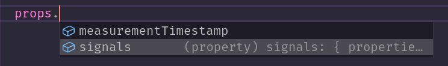

# Extrahorizon Javascript SDK

## 🧙 Installation

Using npm:

```sh
npm install @extrahorizon/javascript-sdk
```

Using yarn:

```sh
yarn add @extrahorizon/javascript-sdk
```

## ⚙️ Configuration

### Authentication

<details>
    <summary>OAuth1 authentication</summary>

```js
import { client } from '@extrahorizon/javascript-sdk';

const sdk = client({
  apiHost: 'dev.fibricheck.com',
});

await sdk.auth.authenticate({
  consumerKey: '',
  consumerSecret: '',
  tokenKey: '',
  tokenSecret: '',
});
```

</details>

<details>
    <summary>OAuth2 Password Grant flow</summary>

```js
import { client } from '@extrahorizon/javascript-sdk';

const sdk = client({
  apiHost: '',
});

await sdk.auth.authenticate({
  clientId: '',
  password: '',
  username: '',
});
```

</details>

<details>
    <summary>OAuth2 Authorization Code Grant flow with callback</summary>

```js
import { client } from '@extrahorizon/javascript-sdk';

const sdk = client({
  apiHost: '',
  freshTokensCallback: tokenData => {
    localStorage.setItem('tokenData', tokenData);
  },
});

await sdk.auth.authenticate({
  clientId: '',
  code: '',
  redirectUri: '',
});
```

</details>

<details>
    <summary>OAuth2 Refresh Token Grant flow</summary>

```js
import { client } from '@extrahorizon/javascript-sdk';

const sdk = client({
  apiHost: '',
});

await sdk.auth.authenticate({
  refreshToken: '',
});
```

</details>

<details>
    <summary>OAuth2 password grant flow with two-step MFA in try / catch</summary>

```js
import { client, MfaRequiredError } from '@extrahorizon/javascript-sdk';

const sdk = client({
  apiHost: '',
});

try {
  await sdk.auth.authenticate({
    clientId: '',
    password: '',
    username: '',
  });
} catch (error) {
  if (error instanceof MfaRequiredError) {
    const { mfa } = error.response;

    // Your logic to request which method the user want to use in case of multiple methods
    const methodId = mfa.methods[0].id;

    await sdk.auth.confirmMfa({
      token: mfa.token,
      methodId,
      code: '', // code from ie. Google Authenticator
    });
  }
}
```

</details>

<br>

### Your first request

With es6 imports

```js
import { client } from '@extrahorizon/javascript-sdk';

(async () => {
  const sdk = client({
    apiHost: '',
  });

  await sdk.auth.authenticate({
    clientId: '',
    password: '',
    username: '',
  });

  console.log('sdk.users.health()', await sdk.users.health());
  console.log('sdk.users.me()', await sdk.users.me());
})();
```

### Tests

To run the unit tests: `yarn start`

To run them in watch mode: `yarn start:watch`

To run e2e tests, copy `.env.example` to `.env` and set up the credentials

Then in `jest.config.js` comment line '/tests/e2e/' and run `yarn test:e2e`

### RQL builder

The Extrahorizon Javascript SDK also export an rqlBuilder to build valid RQL strings. For more info see: https://developers.extrahorizon.io/guide/rql.html

```ts
import { rqlBuilder } from '@extrahorizon/javascript-sdk';

const rql = rqlBuilder().select('name').eq('name', 'fitbit').build();
// ?select(name)&eq(name,fitbit)
```

### Logging

You can pass in two logger function that will be called by Axios on every request/response respectively.

```ts
import AxiosLogger from "axios-logger";

const sdk = client({
  apiHost: "https://api.dev.fibricheck.com",
  requestLogger: AxiosLogger.requestLogger,
  responseLogger: AxiosLogger.responseLogger,
});

await sdk.authentiate({
  refreshToken: 'refreshToken'
})

await sdk.users.health();

[Axios][Request] POST /auth/v2/oauth2/token {"grant_type":"refresh_token","refresh_token":"refreshToken"}
[Axios][Response] POST /auth/v2/oauth2/token 200:OK {"access_token":"accessToken","token_type":"bearer","expires_in":299.999,"refresh_token":"refreshToken","user_id":"userId","application_id":"applicationId"}

[Axios][Request] GET /auth/v2/health
[Axios][Response] GET /auth/v2/health 200:OK

```

### Typescript for your Schemas

If you know the type info of your schemas, you can pass in the Typescript info when initializing the client. You will need to import the `ConfigurationType` to define properties on a schema.

```ts
import type { ConfigurationType } from '@extrahorizon/javascript-sdk';
type SchemaStatus = {
  start: any;
  annotate: any;
  review: any;
  panel: any;
  expert: any;
  completed: any;
  lambda: any;
};

type SchemaProperties = {
  signals: {
    type: ConfigurationType.OBJECT;
    properties: {};
  };
  measurementTimestamp: {
    type: ConfigurationType.STRING;
    format: ConfigurationType.DATE_TIME;
  };
};

const sdk = client<SchemaStatus, SchemaProperties>({
  apiHost: 'https://api.dev.fibricheck.com',
});

const { data: schemas } = await sdk.data.find();
const props = schema[0].properties;
```

You then have easy access to your typed properties



## 📚 Docs --> TODO

- [docs](https://extraHorizon.github.io/javascript-sdk/)

## 📝 Changelog

You can check the changelog on the [releases](https://github.com/ExtraHorizon/javascript-sdk/releases) page.

## 🔑 License

The MIT License (MIT). Please see [License File](/LICENSE) for more information.
