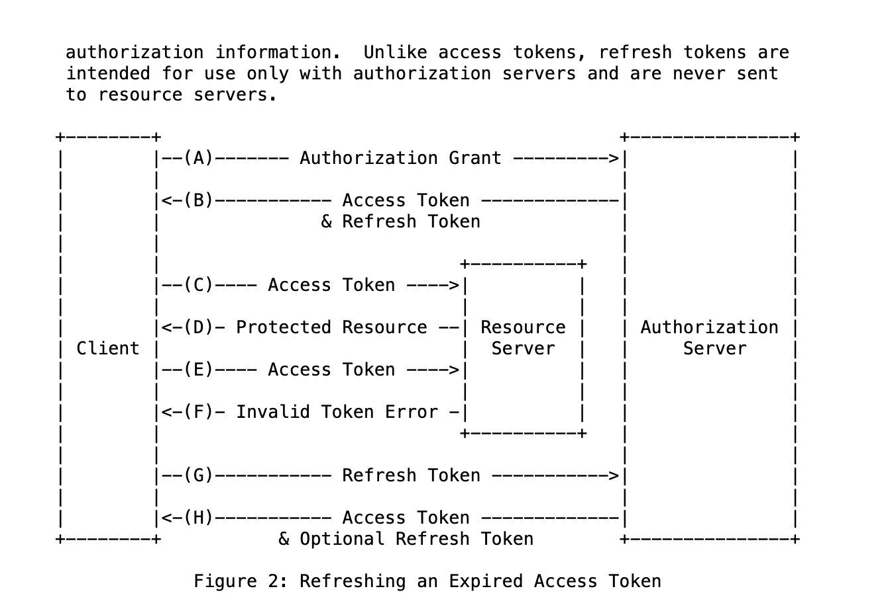

## Snippet for authentication flow (Oauth2)

Each time the SDK refreshes the `accessToken` the `freshTokensCallback` is called with the response. You can store this data in `localStorage` or any other persistant data store. When you restart your application, you can check the data store for a `refreshToken` and use that to authenticate with the SDK.

```ts
import { createOAuth2Client } from '@extrahorizon/javascript-sdk';

const sdk = createOAuth2Client({
  host: '',
  clientId: '',
  freshTokensCallback: tokenData => {
    localStorage.setItem('refreshToken', tokenData.refreshToken);
  },
});

try {
  const refreshToken = await localStorage.getItem('refreshToken');

  if (refreshToken) {
    await sdk.auth.authenticate({
      refreshToken,
    });
  } else {
    // redirect to /login
  }
} catch (error) {
  localStorage.removeItem('refreshToken');
  // redirect to /login
}
```

## Snippet for authentication flow (Oauth1)

You need to capture the response from the `authenticate` function when logging in with `email` / `password` so that subsequent SDK initializations such as app restarts can use the `key` / `secret` combination stored in persistent data storage to authenticate the current user.

```ts
import { createOAuth1Client } from '@extrahorizon/javascript-sdk';

const sdk = createOAuth1Client({
  host: 'dev.fibricheck.com',
  consumerKey: '',
  consumerSecret: '',
});

try {
  const tokenData = await localStorage.getItem('tokenData');

  if (tokenData) {
    await sdk.auth.authenticate({
      token: tokenData.key,
      tokenSecret: tokenData.secret,
    });
  } else {
    // redirect to /login
    const result = await sdk.auth.authenticate({
      email: '',
      password: '',
    });
    localStorage.setItem('tokenData', result);
  }
} catch (error) {
  localStorage.removeItem('tokenData');
  // redirect to /login
}
```

## Proxy client

The package export a client you can use in combination with a proxy service. The client will throw a typed error in case you need to redirect to the login page.

```ts
import { createProxyClient } from '@extrahorizon/javascript-sdk';

const loginPageUrl = 'https://pages.dev.fibricheck.com/login';

(async () => {
  try {
    const sdk = createProxyClient({ host: 'apx.dev.fibricheck.com' });
    await sdk.users.me();
  } catch (error) {
    if (
      error instanceof UserNotAuthenticatedError ||
      error instanceof OauthTokenError
    ) {
      redirectToUrl(`${loginPageUrl}/?redirect=${window.location.url}`);
    }
  }
})();
```

### Local setup

If you want to use the proxy sdk locally, you need to make some changes to your local setup.

- Add `127.0.0.1 local.yourdomain.com` to your `/etc/hosts` file (or if you are using Windows `c:\Windows\System32\Drivers\etc\hosts`)
- Start your server with https enabled.
  - For Mac/Linux, this can be done by running `HTTPS=true yarn start`.
  - For Windows, you have to add `HTTPS=true` to your user environment. Once the variable has been set, run `yarn start`.
- Open your browser `https://local.yourdomain.com:3000/` and skip the security warning.
- Assuming you want to connect to the dev environment:
  - Navigate to `https://pages.dev.fibricheck.com/login/` and login with your account. Once logged in, a cookie will be created named `dev-fibproxy`. To access this cookie on your local domain, set the property `SameSite=None`.

### Snippet for stored credentials

When you already use the `exh/cli` tool, you can use this snippet to initialize. More info: https://docs.extrahorizon.com/cli/setup/credentials

```ts
import fs from 'fs';
import path from 'path';
import {
  parseStoredCredentials,
  createOAuth1Client,
} from '@extrahorizon/javascript-sdk';

const EXH_CONFIG_FILE = path.join(process.env.HOME, '/.exh/credentials');

const readFile = () => {
  try {
    return fs.readFileSync(EXH_CONFIG_FILE, 'utf-8');
  } catch (err) {
    throw new Error(
      `Failed to open credentials file. Make sure they are correctly specified in ${EXH_CONFIG_FILE}`
    );
  }
};

try {
  const credentials = parseStoredCredentials(readFile());
  const sdk = createOAuth1Client({
    consumerKey: credentials.API_OAUTH_CONSUMER_KEY,
    consumerSecret: credentials.API_OAUTH_CONSUMER_SECRET,
    host: credentials.API_HOST,
  });
  await sdk.auth.authenticate({
    token: credentials.API_OAUTH_TOKEN,
    tokenSecret: credentials.API_OAUTH_TOKEN_SECRET,
  });
} catch (error) {
  console.log(error);
}
```

## Other examples

### OAuth1

#### Token authentication with optional skip

The `skipTokenCheck` saves ~300ms by skipping validation on your `token` and `tokenSecret`.

```ts
import { createOAuth1Client } from '@extrahorion/javascript-sdk';

const sdk = createOAuth1Client({
  host: 'dev.fibricheck.com',
  consumerKey: '',
  consumerSecret: '',
});

await sdk.auth.authenticate({
  token: '',
  tokenSecret: '',
  skipTokenCheck: true,
});
```

#### Email authentication

```ts
import { createOAuth1Client } from '@extrahorizon/javascript-sdk';

const sdk = createOAuth1Client({
  host: 'dev.fibricheck.com',
  consumerKey: '',
  consumerSecret: '',
});

await sdk.auth.authenticate({
  email: '',
  password: '',
});
```

### OAuth2

#### Password Grant flow

```ts
import { createOAuth2Client } from '@extrahorizon/javascript-sdk';

const sdk = createOAuth2Client({
  host: '',
  clientId: '',
});

await sdk.auth.authenticate({
  password: '',
  username: '',
});
```

#### Authorization Code Grant flow with callback (Only for Fibricheck)

- Open https://pages.dev.fibricheck.com/authorize/?client_id=CLIENT_ID&response_type=code&redirect_uri=REDIRECT_URI
- click Authorize
- Capture the query params on the redirect uri
- Authenticate with the code query param

```ts
import { createOAuth2Client } from '@extrahorizon/javascript-sdk';

const sdk = createOAuth2Client({
  host: '',
  clientId: '',
  freshTokensCallback: tokenData => {
    localStorage.setItem('tokenData', tokenData);
  },
});

await sdk.auth.authenticate({
  code: '',
});
```

#### Refresh Token Grant flow

```ts
import { createOAuth2Client } from '@extrahorizon/javascript-sdk';

const sdk = createOAuth2Client({
  host: '',
  clientId: '',
});

await sdk.auth.authenticate({
  refreshToken: '',
});
```

#### Password Grant flow with two-step MFA in try / catch

```ts
import {
  createOAuth2Client,
  MfaRequiredError,
} from '@extrahorizon/javascript-sdk';

const sdk = createOAuth2Client({
  host: '',
  clientId: '',
});

try {
  await sdk.auth.authenticate({
    password: '',
    username: '',
  });
} catch (error) {
  if (error instanceof MfaRequiredError) {
    const { mfa } = error.response;

    // Your logic to request which method the user want to use in case of multiple methods
    const methodId = mfa.methods[0].id;

    await sdk.auth.confirmMfa({
      token: mfa.token,
      methodId,
      code: '', // code from ie. Google Authenticator
    });
  }
}
```

#### Confidential Applications

If you are using a confidential application in combination with React-Native. The SDK will add `btoa` function to your global scope. See https://github.com/ExtraHorizon/javascript-sdk/issues/446

```ts
const sdk = createClient({
  host: 'https://api.dev.fibricheck.com',
  clientId: '',
  clientSecret: '',
});
```


